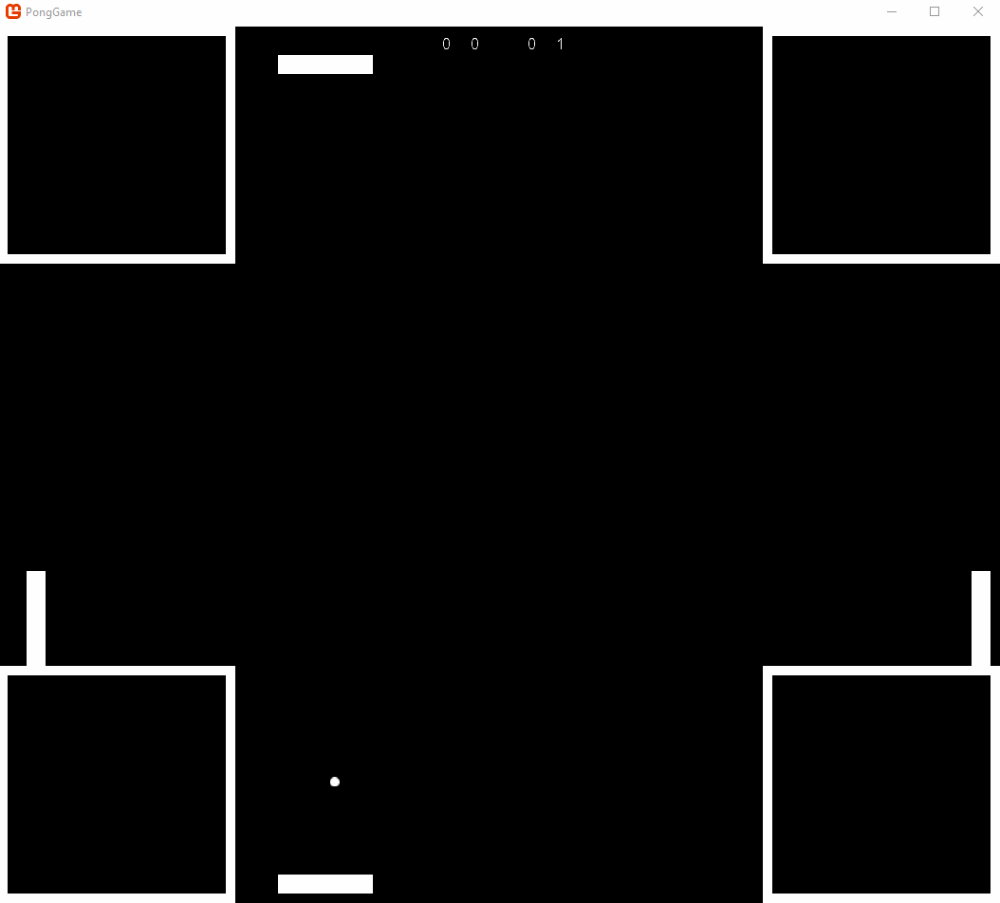
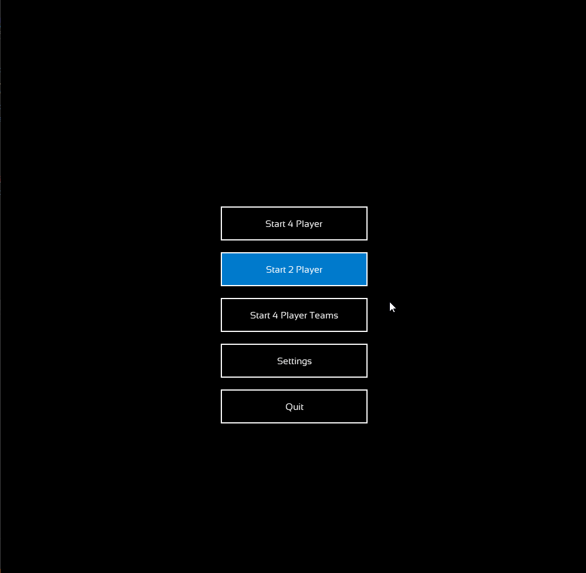
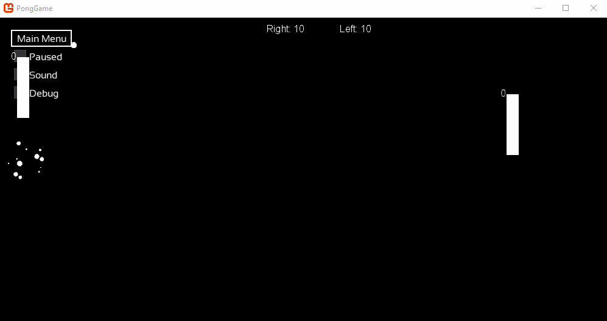

# Quadropong

Four player pong made using monogame.

Astroids, Powerups, and local 4 player controller support!

Boss Battles!

Classic Pong

## Features

- [x] Powerups
  - [x] Bigger Paddle
  - [x] Tiny Paddle
  - [x] Bigger Ball
  - [x] Tiny Ball
  - [x] Stun Paddle
  - [x] Hold Paddle
  - [x] Fast Paddle
  - [x] Fast Ball
- [ ] Bosses
  - [x] Meatball Man Bullet Hell
  - [ ] Flying Saucer stun & fire ball
  - [x] Astroids
  - [ ] French Fries & Drink that rotates the map
- [x] Multiplayer
  - [x] Offline
  - [x] Online
- [x] Gamemodes
  - [x] 4 Player
  - [x] 2 Player
  - [x] 4 Player Teams
- [ ] Show Player stats in the corners
  - [ ] Powerups
  - [x] Healthbar
  - [x] Points
- [x] Save Game State
  - [x] Ball
  - [x] Paddle
  - [x] Score
  - [x] Health
- [ ] Main Menu
  - [x] Start
  - [x] Reset
  - [x] Quit
  - [ ] Settings
    - [ ] Volume
    - [ ] Music
    - [x] Sound
    - [x] Fullscreen
    - [ ] Game Settings
      - [ ] Powerups
      - [ ] Bosses
      - [x] Astroids
        
